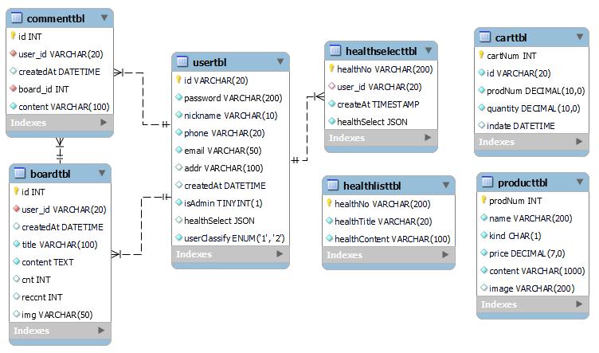
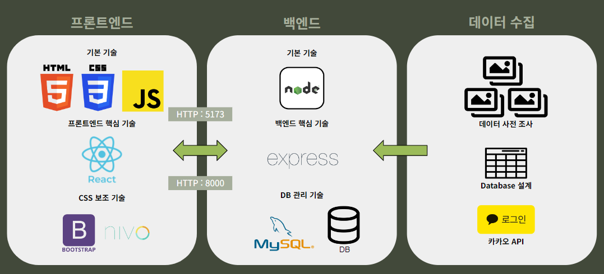
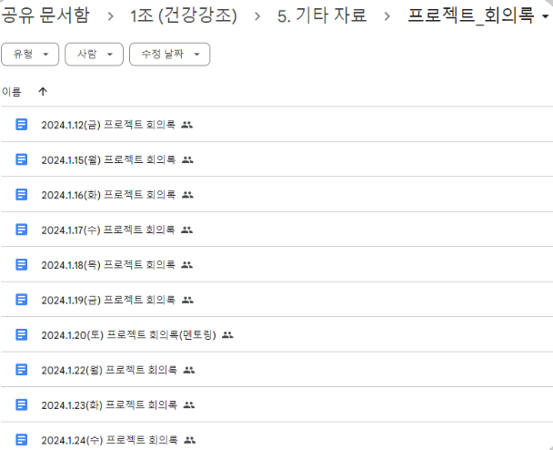
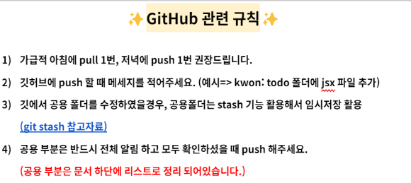

# 목차
1. [프로젝트 소개](#프로젝트-소개)
2. [주요 기능](#주요기능)
3. [ERD구조](#erd구조)
4. [시스템 아키텍처](#시스템-아키텍처)
5. [기술 스택](#기술-스택)
6. [형상관리 - googledrive](#형상관리)
7. [팀문화](#팀문화)

## 프로젝트 소개
### Root Fit

- 커뮤니티를 활용한 건강관리 어플리케이션
- 뿌리부터 건강한 몸 이라는 뜻을 가졌으며, 사용자들이 건강한 삶으로 나아가는 것을 도와드리겠다는 포부가 담겨있습니다.
- 개발 기간 및 인원
  2024.01.12 ~ 2024.02.19
  프론트엔드 6명
### 배포링크
(곧 배포 예정)
### 팀원 및 역할

- 강민서 : 회원가입과 로그인 기능 개발, API총괄
- 권보경 : 회원전용 헬스리스트(투두리스트) 기능 개발, 팀장, 총괄 매니징
- 박종섭 : 쇼핑몰 기능 개발, DB&Design
- 신혜인 : 게시판 기능 개발, 스케줄 관리
- 이지은 : 회원전용 헬스리스트(투두리스트) 기능 개발, 프로젝트 매니징
- 최지성 : 게시판 기능 개발, 협업 유지보수

## 주요기능

- 회원가입
- 게시판
- 쇼핑몰
- 헬스리스트
<!-- ### 홈페이지 사진 -->

<!-- ### 시연 영상 -->

## ERD구조

## 시스템 아키텍처

## 기술 스택

### Front-end

React, HTML, CSS, JavaScript, Bootstrap, nivo

### Back-end

Express, Node, MySQL

### API

Kakao Login API

### Tool

Visual Studio Code, MySQL Workbench CE 8.0, Slack

## 형상관리

## 팀문화
