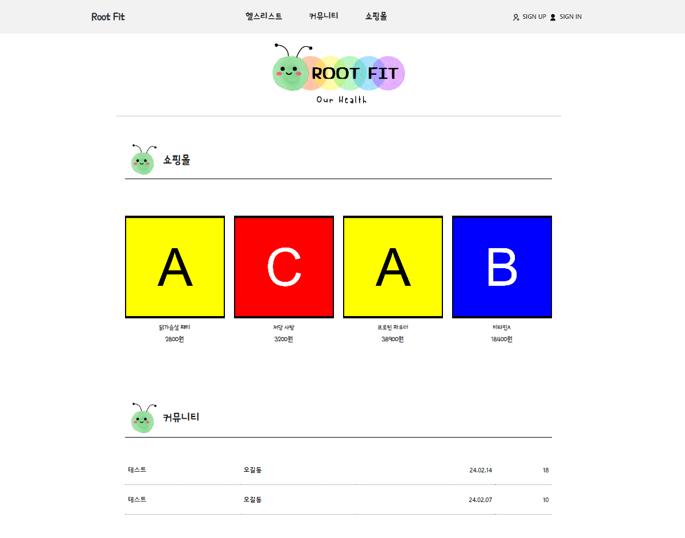

# [Root Fit](https://rootfit.github.io/rootfitreact/) 🏋️‍♂️ 

## 커뮤니티를 활용한 건강관리 어플리케이션

**Root Fit (루트핏) 이란?**

👉 뿌리부터 건강한 몸 이라는 뜻을 가졌으며, 사용자들이 건강한 삶으로 나아가는 것을 도와드리겠다는 포부가 담겨있습니다.

**개발 기간**

👉 2024.01.12 ~ 2024.02.19 (총 5주)

**개발 인원**

👉 총 6명

## 목차

1. [주요 기능](#주요기능)
2. [기술 스택](#기술-스택)
3. [리뷰](#형상관리)
4. [참여한 사람들](#팀문화)

## 주요기능

<!-- 각 파트 wiki 링크 예정 -->

- [회원가입](#)
- [게시판](#)
- [쇼핑몰](#)
- [헬스리스트](#)

## 기술 스택

### Front-end

- React
- HTML
- CSS
- JavaScript
- Bootstrap
- [nivo](#)

### Back-end

- Express
- Node
- MySQL

### API

- [Kakao Login API](#)

### Tool

- Visual Studio Code
- MySQL Workbench CE 8.0
- Slack

## 리뷰

- 앞으로 발전할 수 있는 점

## 참여한 사람들

- 강민서 : 회원가입과 로그인 기능 개발, API총괄
- 권보경 : 회원전용 헬스리스트(투두리스트) 기능 개발, 팀장, 총괄 매니징
- 박종섭 : 쇼핑몰 기능 개발, DB&Design
- 신혜인 : 게시판 기능 개발, 스케줄 관리
- 이지은 : 회원전용 헬스리스트(투두리스트) 기능 개발, 프로젝트 매니징
- 최지성 : 게시판 기능 개발, 협업 유지보수
